# Buenas! 👋
Soy Lautaro Rizzitano, estudiante de Ingeniería en Sistemas en la UTN FRBA.

## Materias 🎓 26/43 
- 1° Año:  8/8  
- 2° Año:  8/8  
- 3° Año:  8/8  
- 4° Año:  2/10  
- 5° Año:  0/9  

## Lenguajes 1️⃣0️⃣1️⃣0️⃣
- C / C++
- Arduino
- Python
- Java
- HTML
- CSS
- JS
- SQL / T-SQL
- Haskell
- Prolog

